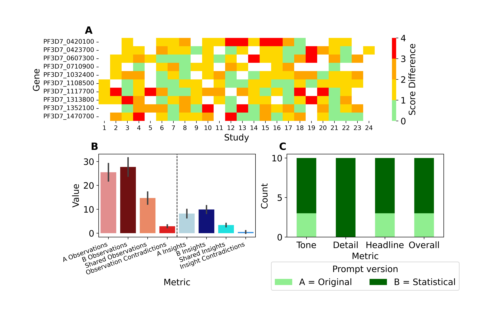

# Statistical AI Transcriptomics Expression Summary
## Magnitude of change investigation
To investigate how often the beta PlasmoDB summary over or understates the magnitude of change, an AI was asked to score the language
within the summaries using this scoring table [scoring_keywords.tsv](scoring_keywords.tsv) for ten random genes using the following prompt
[keyword_prompt.py](keyword_prompt.py). The reults are here [keywords_scored](keywords_scored).
The difference between the language assigned score and the biological importance score assigned using [get_transcriptomics](get_expression_data.py) [genes_scored.xlsx](genes_scored.xlsx) and was plotted with [keyword_heatmap.py](keyword_heatmap.py)

## Generating the statistical based AI expression summary
The PlasmoDB AI expression transcriptomics expression summary was modified to incorporate:
- Different expression statistics
- Fold change directional expression percentiles
- Explicit biological importance and confidence scores

RNA-seq and microarray data was taken from PlasmoDB was taken for all major comparisons. 
Transcriptomics data was collated into a TSV for each gene of interest using the following
script [get_transcriptomics](get_expression_data.py). This script also assigns biological
importance and confidence scores.
The output is here [transcriptomics_data](transcriptomics_data)

Claude was then asked to summarise the transcriptomics data using the following prompt
[Claude comparison](claude_get_report.py)
Here, the AI is first asked to summarise each individual experiment with a focus on statistical
and contextual support. Then the AI is asked to summarise all individual per summary experiments
to identify the most important findings.
The output is here [expression_summary](expression_summary)

## Comparing prompts
The original beta PlasmoDB expression summary and the new statistical based summary were compared using
[comparison_prompt.py](comparison_prompt.py). Here the number of observations/insights were counted in each summary and contradictions were identified. The AI also identified its prefered summary on the following metrics: headline, tone, technical detail and overall.
The output is here [comparison_output](comparison_output)

