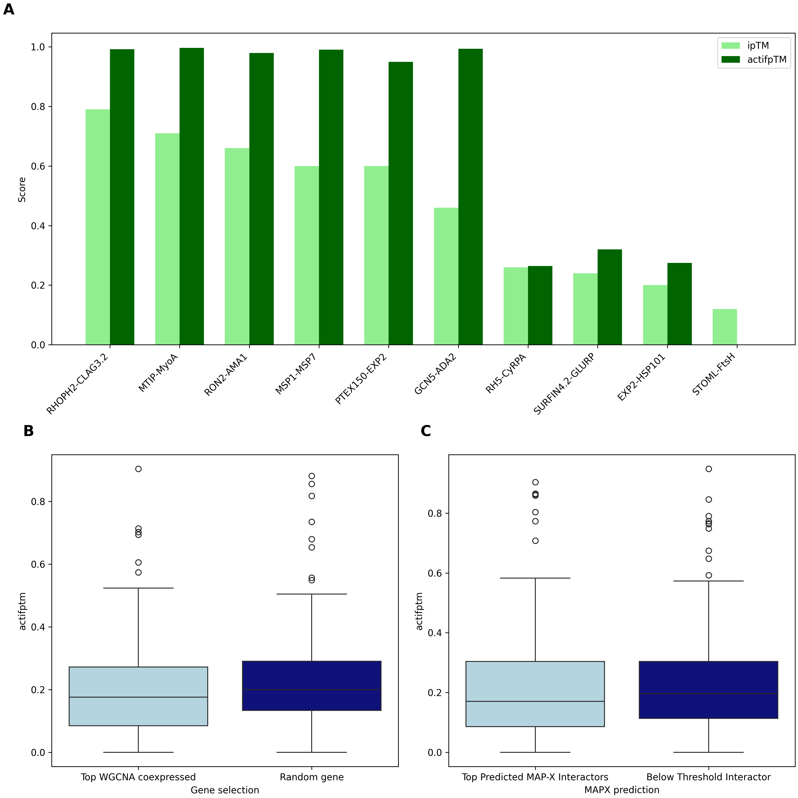

# AI Functional Prediction Pipeline

## Processing the data
Transcriptomics (RNA-seq and microarray), proteomics, PTM and mutagenesis data was prepared using [get_expression_data.py](get_expression_data.py).
Which produced a transcriptomics TSV and an additional data TSV, which can be found within the individual gene's folders
[PF3D7_1133500](PF3D7_1133500)

WGCNA coexpression data [idc_af3_top50.tsv](idc_af3_top50.tsv) was processed using [get_coexpression_data.py](get_coexpression_data.py)
producing a text document with product descriptions and GO terms of coexpressed genes for the gene of interest. Results are in the 
gene folders

HyperLOPIT subcellular localisation data was processed using [get_localisation_data.py](get_localisation_data.py)
producing a text document containing the subcellular niche, GO terms of genes in that niche and any WGCNA coexpressed genes that 
were found in this niche. Results are in the gene folders

Curated interaction data and MAP-X predicted interactors were processed using [get_mapx_binding_data.py](get_mapx_binding_data.py).
Here curated protein complex interactions were taken from (Pazicky et al., 2025). To determine the precision/recall of predicted MAP-X interactors
this script was used [MAP_threshold.py](MAP_threshold.py) and interactors were retained if their calibrated prediction score exceeded a precision 
of 0.9 for the 4- and 6-hour IDC timepoints, or a precision of 0.8 for the remaining timepoints (to retain recall at these stages) when 
mapped to the curated dataset [MAP_genes_final.py](MAP_genes_final.py). The interactions that passed are here [mapx_pass_threshold.tsv](mapx_pass_threshold.tsv)
Curated and predicted interactors were processed into a text document that had product descriptions and GO terms of both. Results are in the gene folders

## AI Prompt
This data was provided to Claude Opus 4.6 using this prompt [claude_api.py](claude_api.py). 
Claude was asked to generate five functional predictions, ranked by likelihood. The LLM was not provided with the gene identifiers of 
the genes of interest. The LLM was also asked to provide a brief overall summary of the gene's function and was instructed to produce 
per-evidence-type summaries, giving justification for the conclusions reached. It was further instructed to report its confidence in each 
functional prediction, and to suggest experimental methods that could confirm the predictions. Responses were reported in markdown format
which are found within the prompt_output folders within the gene folders [PF3D7_1133500/Prompt_outputs](PF3D7_1133500/Prompt_outputs).

## AlphaFold Analysis
AlphaFold3 was run on 10 experimentally confirmed protein interactors and the chain_ipTM and actifpTM can be found here 
[curated_interactors.tsv](curated_interactors.tsv). For 10 randomly selected genes with ≥10 MAPX-predicted interactors, AlphaFold3 was run on each gene of interest paired with its top 10 MAPX-predicted interactors, as well as with 10 interactors that did not pass the MAPX score threshold [wgcna_scored.tsv](wgcna_scored.tsv). Additionally, for these same 10 genes, AlphaFold3 was run on each gene paired with its top 10 WGCNA-coexpressed genes, and with 10 random genes from unrelated WGCNA modules for comparison [mapx_scored.tsv](mapx_scored.tsv). The script used to run AF3 for the WGCNA test is here [afwgcna.sh](afwgcna.sh). The script used to run actifpTM
is here [actifptm.py](actifptm.py). To extract the chain_ipTM and actifpTM from the jsons, this script was used [extract_scores.py](extract_scores.py).

The AF3 results were then plotted using [af3_panel.py](af3_panel.py)

