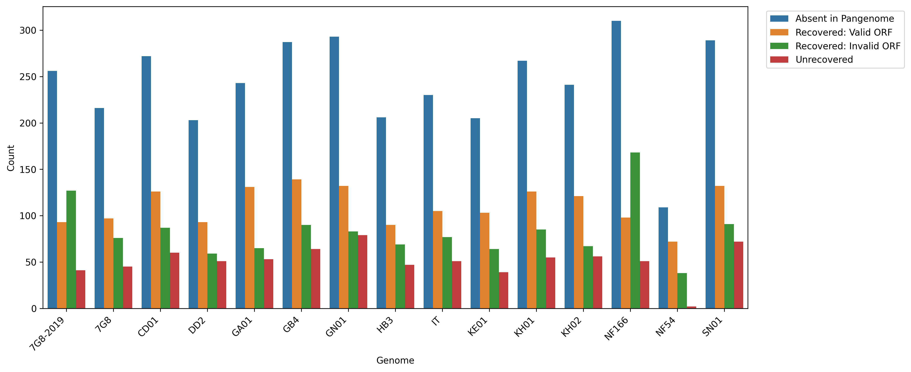

# Exploring duplications and 3D7 reference absent genes

## Duplications
Potential duplications were identified as multiple genes from the same genome contributing to a pangene cluster using [dups_PSEUDO.py](dups_PSEUDO.py)
They are listed here [duplications_PSEUDO.tsv](duplications_PSEUDO.tsv)

## Reference absent genes
Pangene clusters lacking a 3D7 gene were identified using [get_liftoff_gffs_PSEUDO.py](get_liftoff_gffs_PSEUDO.py) and their gffs
were extracted. LiftOff of the reference absent genes to 3D7 was performed using [lift_off_SLURM.sh](LIFTOFF_PSEUDO.sh).
Genes that could not be mapped to 3D7 are here [unmapped_genes](unmapped_genes).
The number of genes per genome that could not be mapped to 3D7 was plotted [plotting_unmapped_genes.py](plotting_unmapped_genes.py)

The genomic position of these reference absent genes were identified using [absent_genes_info.py](absent_genes_info.py) and core/subtelomeric genes
were identified using [absent_info_core.py](absent_info_core.py). Results are in [no_flank_unmapped_genes_location.csv](no_flank_unmapped_genes_location.csv)
