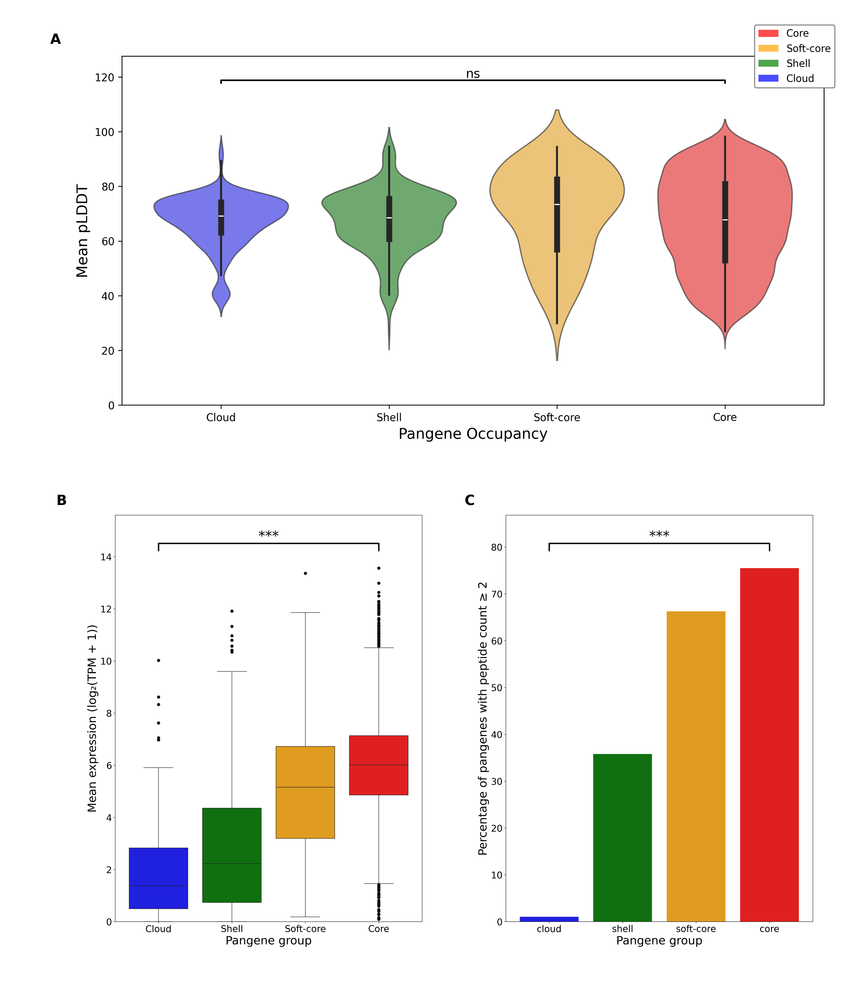

# Exploring the pangenome
Here are the scripts and outputs of analysis used to explore the *P. falciparum* pangenome, exploring interpro domains, paralog counts, ortholog counts and protein lengths. In addition
the evidence to support the pangenes was explored by mapping mean pLDDT, RNA-seq data and peptide counts to the pangenome.

## Percentage with valid InterPro domain
The InterPro IDs were taken from PlasmoDB and mapped to the pangene clusters, the mean percentage of pangenes within each occupancy was calculated. [InterPro](valid_interpro.py)

## Protein length
The length of proteins were taken from PlasmoDB and mapped to the pangene clusters, a box plot was created to show the distribution of protein lengths amongst pangenome classifications. [Protein length](protein_length.py)

## Paralog counts
The paralog counts were taken from PlasmoDB and mapped to the pangene clusters, a box plot was created to show the distribution of paralog counts. [Paralog counts](paralog_count.py). This analysis was also repeated with *rif* and *var* genes removed. [Filtered 

## Ortholog counts
The ortholog counts were taken from PlasmoDB and mapped to the pangene clusters, a box plot was created to show the distribution of ortholog counts. This analysis was also repeated with *rif* and *var* genes removed. [Filtered Orthologs]

The figure is shown below:

# Evidence to support the pangenome

## Mean pLDDT
AlphaFold statistics were calculated for each pangene and the mean pLDDT was mapped to each pangenome occupancy. The script is here [Mean pLDDT](plddt.py)

## RNA-seq
All available RNA-seq datasets were taken from PlasmoDB and filtered to include sense strand (unique) only data. Gene expression was mapped to the pangene clusters- note that gene expression data was only available for 3D7. 
Script is here: [RNA-seq](Gene_expression.py)
Data is here: 

## Proteomics
Peptide count data were taken from PlasmoDB (21 mass spectrometry experiments in total), and the percentage of pangenes with a sum of unique peptides across samples ≥2 was calculated for each pangenome classification.
The script is here: [Peptide count](proteomics.py)
Data is here:

The figure is shown below:

