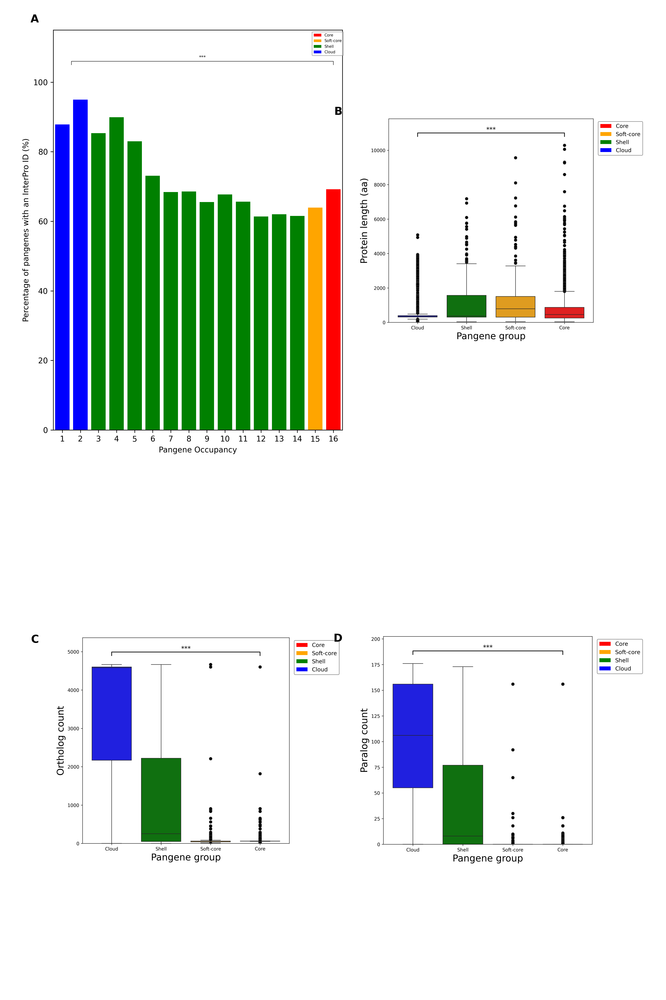
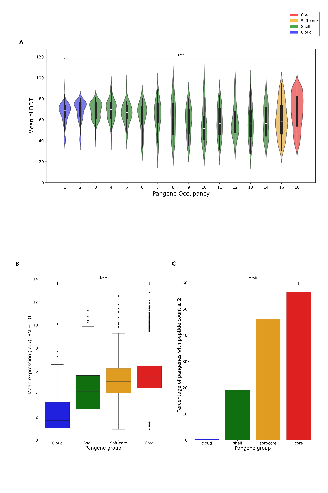

# Exploring the pangenome
Here are the scripts and outputs of analysis used to explore the *P. falciparum* pangenome, exploring interpro domains, paralog counts, ortholog counts and protein lengths. In addition
the evidence to support the pangenes was explored by mapping mean pLDDT, RNA-seq data and peptide counts to the pangenome.

## Percentage with valid InterPro domain
The InterPro IDs were taken from PlasmoDB and mapped to the pangene clusters, the mean percentage of pangenes within each occupancy was calculated. [InterPro](valid_interpro.py)

## Protein length
The length of proteins were taken from PlasmoDB and mapped to the pangene clusters, a box plot was created to show the distribution of protein lengths amongst pangenome classifications. [Protein length](protein_length.py)

## Paralog counts
The paralog counts were taken from PlasmoDB and mapped to the pangene clusters, a box plot was created to show the distribution of paralog counts. [Paralog counts](paralog_count.py). This analysis was also repeated with RIF and VAR genes removed. [Filtered Paralogs](paralog_box_grouped_filtered_sixteen.png)

## Ortholog counts
The ortholog counts were taken from PlasmoDB and mapped to the pangene clusters, a box plot was created to show the distribution of ortholog counts. This analysis was also repeated with RIF and VAR genes removed. [Filtered Orthologs](ortholog_box_grouped_filtered_sixteen.png)

The figure is shown below:

# Evidence to support the pangenome

## Mean pLDDT
AlphaFold statistics were calculated for each pangene and the mean pLDDT was mapped to each pangenome occupancy. The script is here [Mean pLDDT](plddt.py)

## RNA-seq
All available RNA-seq datasets were taken from PlasmoDB and mapped to the pangene clusters- note that gene expression data was only available for 3D7. 
Script is here: [RNA-seq](Gene_expression.py)

## Proteomics
Peptide count data was taken from Siddiqui et al. (2022) and mapped to the pangenome clusters- note that peptide count was only available for 3D7

Ghizal Siddiqui, Amanda De Paoli, Christopher A MacRaild, Anna E Sexton, Coralie Boulet, Anup D Shah, Mitchell B Batty, Ralf B Schittenhelm, Teresa G Carvalho, Darren J Creek, A new mass spectral library for high-coverage and reproducible analysis of the Plasmodium falciparum–infected red blood cell proteome, GigaScience, Volume 11, 2022, giac008, https://doi.org/10.1093/gigascience/giac008
The script is here: [Peptide count](proteomics.py)

