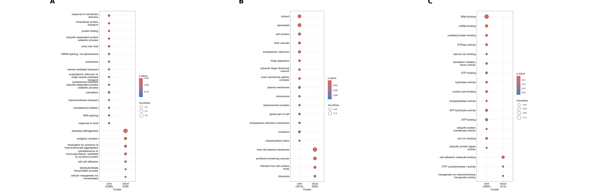

# Exploring the functions of pangenes

This folder holds the scripts and outputs of the analysis into the functions of the core and cloud
pangenes.

## GO Enrichment
GO analysis was performed using ClusterProfiler for MF, BP and CC. The R markdown script is here
[Cluster Rmd](Cluster.Rmd)

To run ClusterProfiler the GO annotations were selected using this script
[Best annotations](Best_annotations.py)

