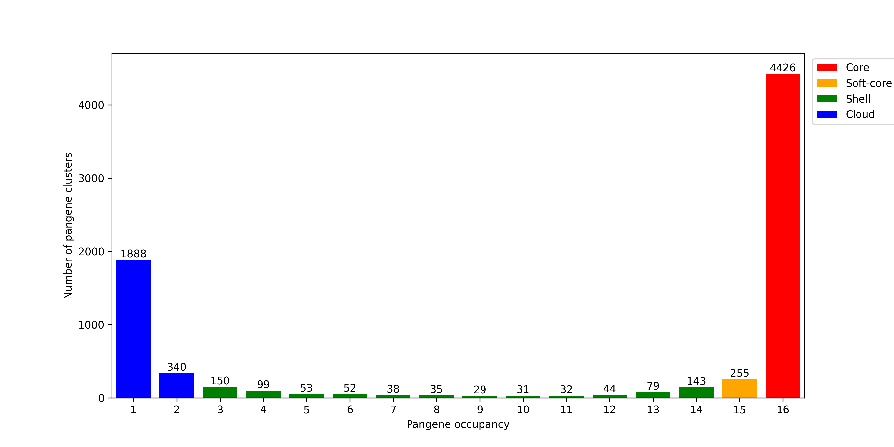

# Generating the *Plasmodium falciparum* Pangenome Using the GET_PANGENES Pipeline

This repository contains the scripts and outputs for running the GET_PANGENES pipeline 
on 20 *P. falciparum* whole-genome assemblies to generate the *P. falciparum* pangenome.

---

## Running GET_PANGENES
The SLURM script for running GET_PANGENES can be found here: [`Running GET_PANGENES`](Running%20GET_PANGENES).
Output, including the pangenome matrix and pangenome growth simulation results, can be 
found in [`GET_PANGENES_OUTPUT`](GET_PANGENES_OUTPUT).

---

## Quality Control
Quality metrics were generated using the bash script [`Run quality control`](Quality/Run%20quality%20control), 
with the resulting metrics file found at [`Quality/all_clusters_quality.txt`](Quality/all_clusters_quality.txt).
Plots of quality metrics were produced using [`Quality/Quality.py`](Quality/Quality.py) 
and can be found in the [`Quality`](Quality) folder.

A Python script is also provided that maps each genome against 3D7 to identify any 
structural abnormalities: [`Gene Locations.py`](Gene%20Locations.py)

---

## Pangenome Graphs
The pangenome occupancy bar chart was generated using [`Pangenome_occupancy_graph.py`](Pangenome_occupancy_graph.py).

The singleton count per genome was generated using [`Singletons_graph.py`](Singletons_graph.py).

Pangenome growth simulation graphs were produced using 
[`Produce_pangenome_growth`](Produce_pangenome_growth), with results found in 
[`core_gene.tab_core_both.pdf`](core_gene.tab_core_both.pdf) and 
[`pan_gene.tab_pan.pdf`](pan_gene.tab_pan.pdf).

The POCS dendrogram and heatmap were produced using [`POCS_Dendrogram.py`](POCS_Dendrogram.py).

# 16 genome pangenome
GET_PANGENES was rerun on 16 genomes to exlude the following genomes:
- ML01 (mixed infection)
- TG01 (mixed infection)
- SD01 (large missassembly)
- NF135.C10 (admixed infection)

