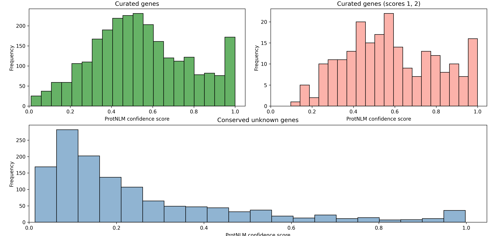
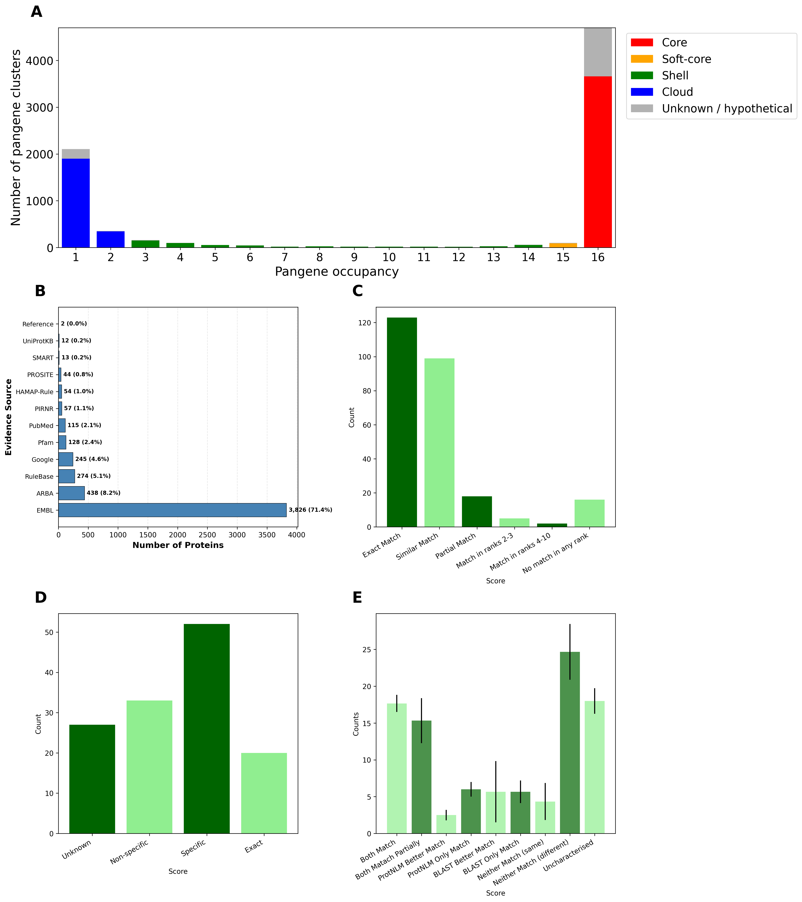

# PROTNLM analysis

## Quantifying unknown genes
The proportion of unknown genes across each pangenome occupancy was quantified using [`unknown_occupancy_PSEUDO.py`](unknown_occupancy_PSEUDO.py)

## Uniprot Evidence Codes
The evidence codes for the 3D7 proteome were extracted using [`protnlm_panel.py`](protnlm_panel.py)

## ProtNLM curated genes
ProtNLM was run on all 3D7 genes with literature supported annotations in PlasmoDB using the available release listed 
in the ProtNLM Github. For a subset of 10% of genes the ProtNLM predictions were compared to the PiroplasmaDB
product descriptions [`ProtNLM_data.xlsx`](ProtNLM_data.xlsx) using the scoring criteria in [`Supplementary_scoring.xlsx`](Supplementary_scoring.xlsx)

## ProtNLM unknown genes
Curated ProtNLM confidence scores were plotted  and the median confidence scores for exact and similar matches was calculated. Unknown proteins with ProtNLM predictions that exceeded this threshold were selected and the specificity of their
predictions were scored [`Supplementary_scoring.xlsx`](Supplementary_scoring.xlsx) [`ProtNLM_data.xlsx`](ProtNLM_data.xlsx).

## ProtNLM *Babesia ovis* 
To run ProtNLM on a genome abesent from ProtNLM's training data, ProtNLM was runing on *B. ovis* an apicomplexan species.
To assess whether ProtNLM out performs BLAST, BLAST was run on three random sets of 100 genes with UniRef90 as the database
[`babesia_bash.sh`](babesia_bash.sh). The BLAST and ProtNLM predictions were scored [`Supplementary_scoring.xlsx`](Supplementary_scoring.xlsx) [`ProtNLM_data.xlsx`](ProtNLM_data.xlsx).

