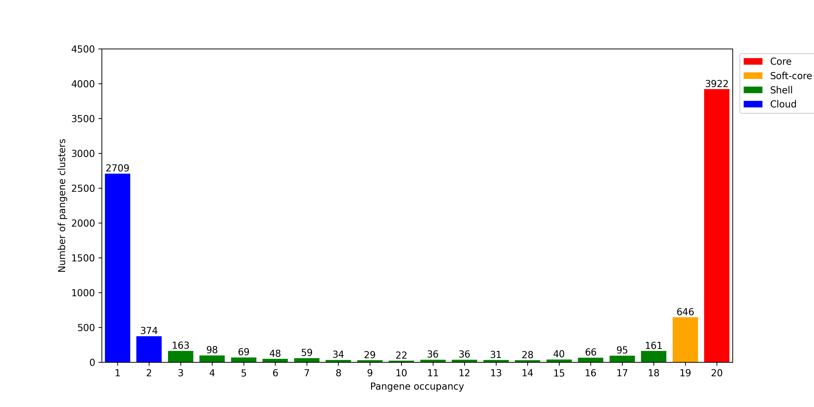
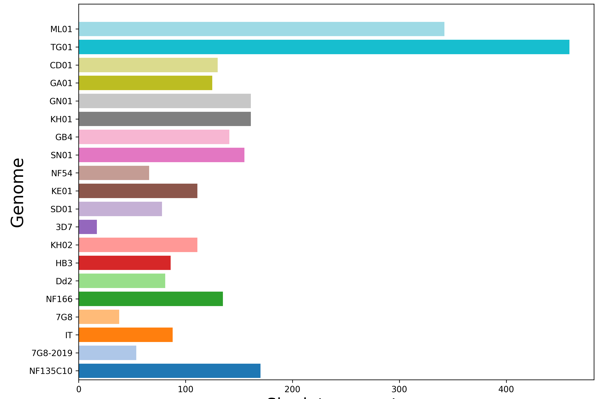
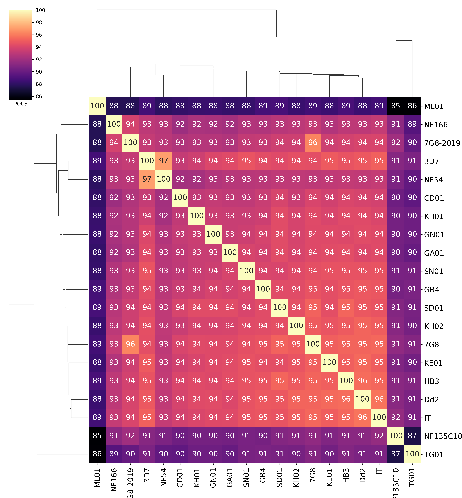
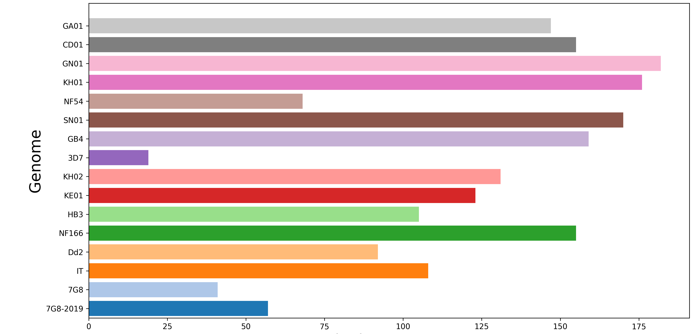
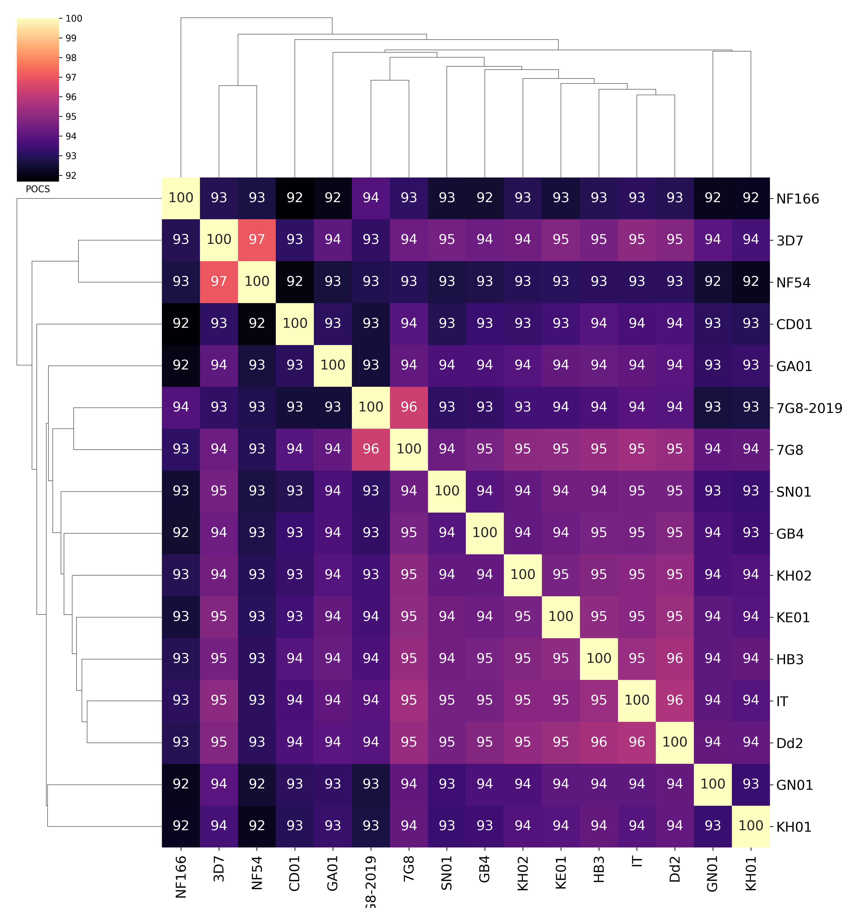

# P_falciparum-pangenome
The scripts used to build and explore the pangenome of Plasmodium falciparum using the GET_PANGENES pipeline
----------------------------
## LiftOff Analysis
Prior to pangenome construction, LiftOff version 1.6.3 was used to transfer the curated 
gene annotations of the 3D7 reference genome to the 19 non-reference *P. falciparum* 
assemblies. This was performed as a quality check to assess whether the existing genome 
annotations required updating before inclusion in the pangenome. GffCompare version 0.12.10 
was used to compare the lifted over annotations to the original genome annotations, and 
pairwise protein alignment was carried out to characterise any non-exact matches. Only 
limited differences were identified and the original annotations were retained for 
pangenome construction.

Full details of the LiftOff analysis, including scripts and results, can be found in the
[LiftOff README](LiftOff/README.md).
----------------------------
## Running GET_PANGENES to Produce the *P. falciparum* Pangenome

To construct the *P. falciparum* pangenome, the GET_PANGENES pipeline was run on 20 
whole-genome *P. falciparum* assemblies.
Full details of the pipeline, scripts and 
outputs can be found in the [GET_PANGENES README](GET_PANGENES/README.md).
The resulting pangenome was found to consist of approximately 45% core genes.

Pangenome growth simulations were computed to estimate the total size of the core and 
pan-genome (20 permutations). The number of singleton genes contributed by each genome 
was also identified.

Sample distance heatmaps were computed to explore the genomic similarity between 
genome assemblies using POCS (Percentage of Conserved Sequences).

## Rerunning GET_PANGENES
The analysis was re run on 16 genomes exlcuding ML01, TG01, SD01 and NF135.C10 were not found to be of high enough quality (mixed infections, assembly errors).
These genomes were inflating the cloud, shell and soft-core count.

The new results are also found in [GET_PANGENES README](GET_PANGENES/README.md).

