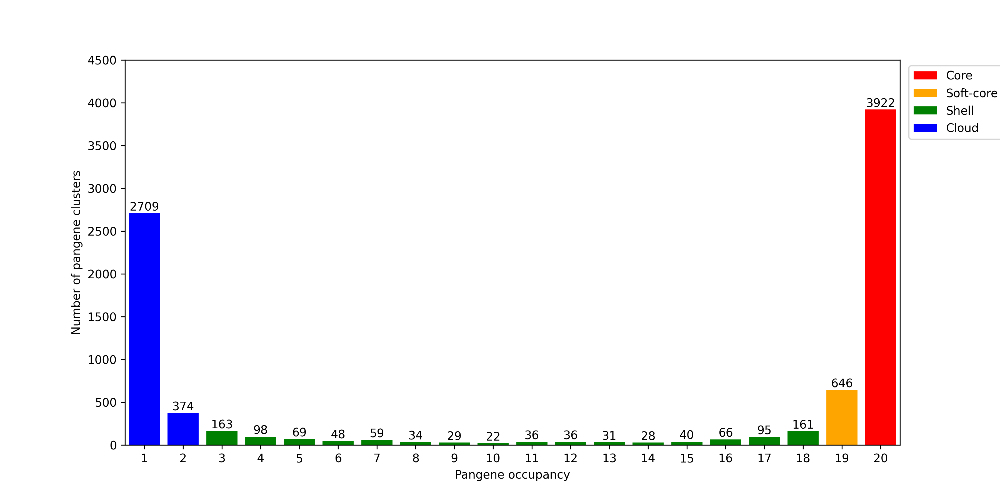
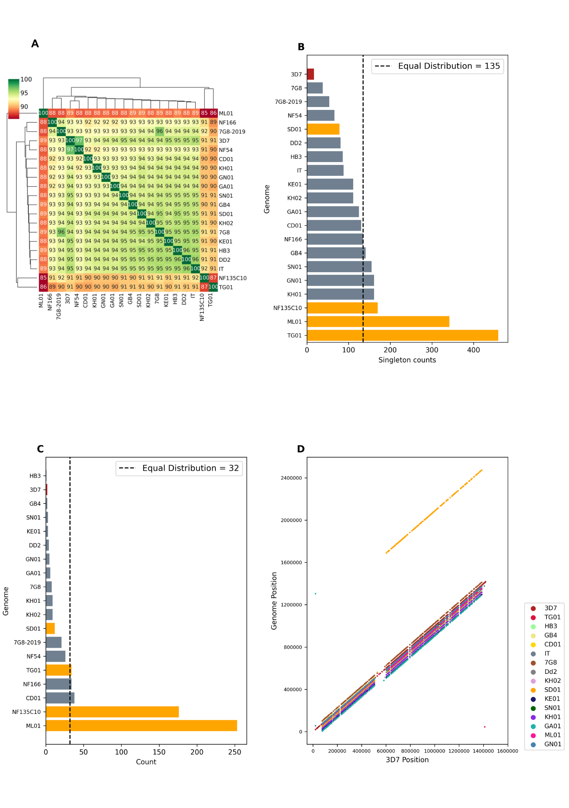
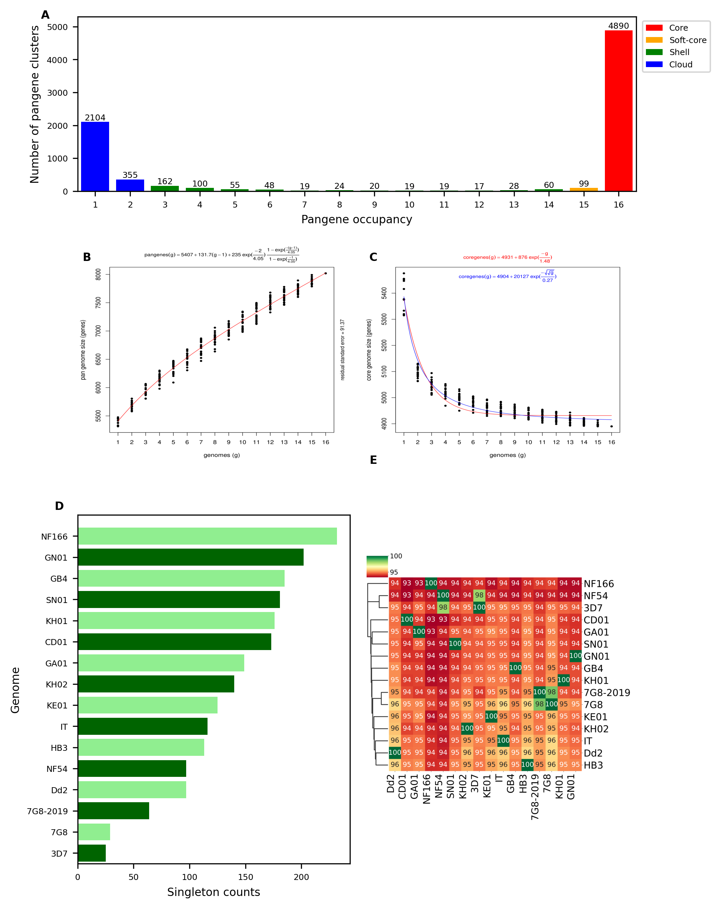
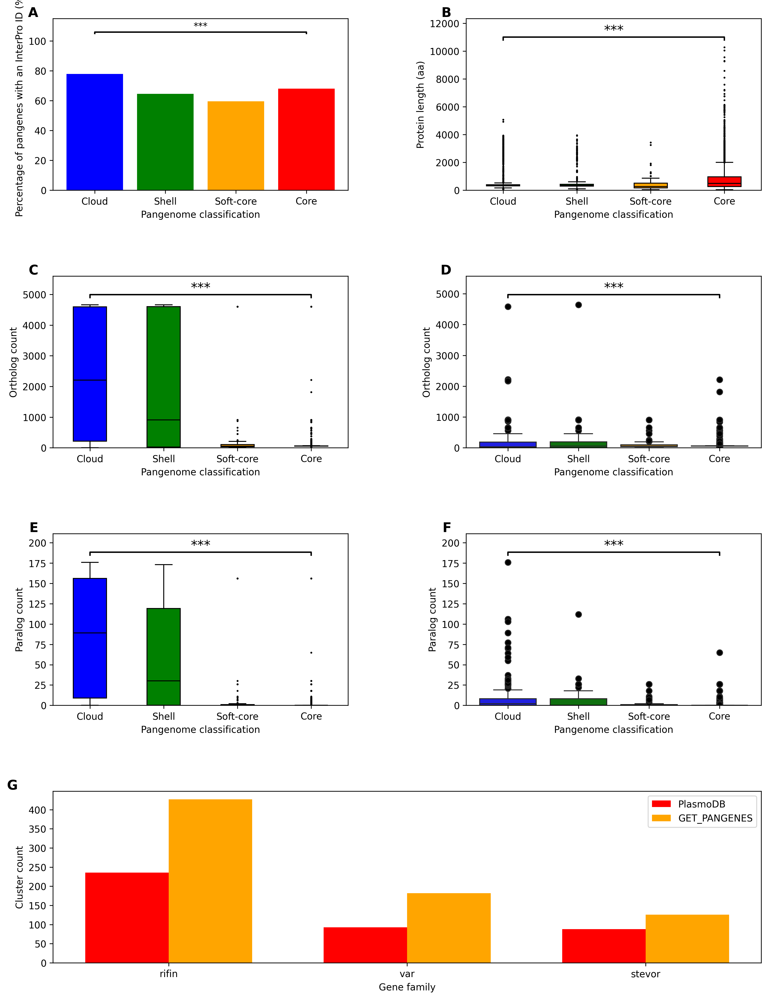
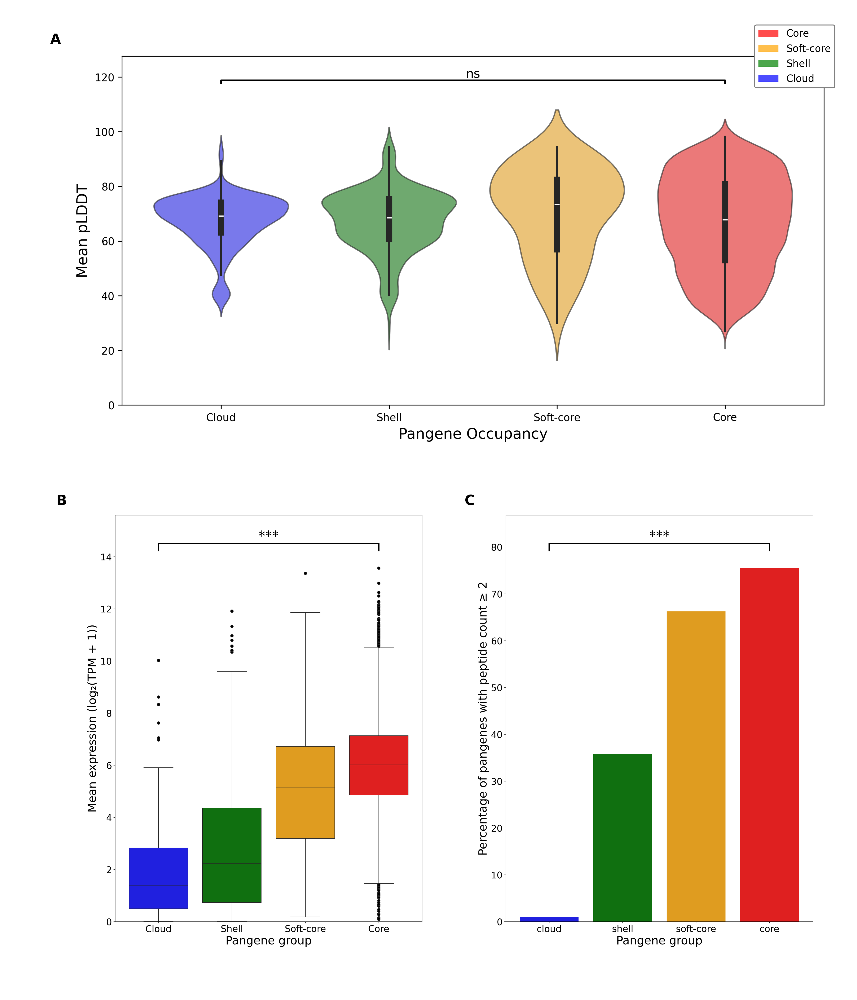
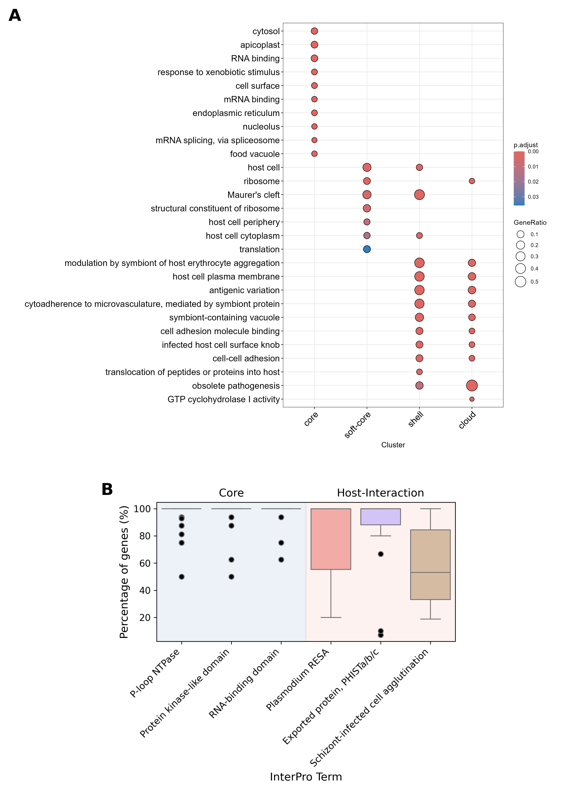
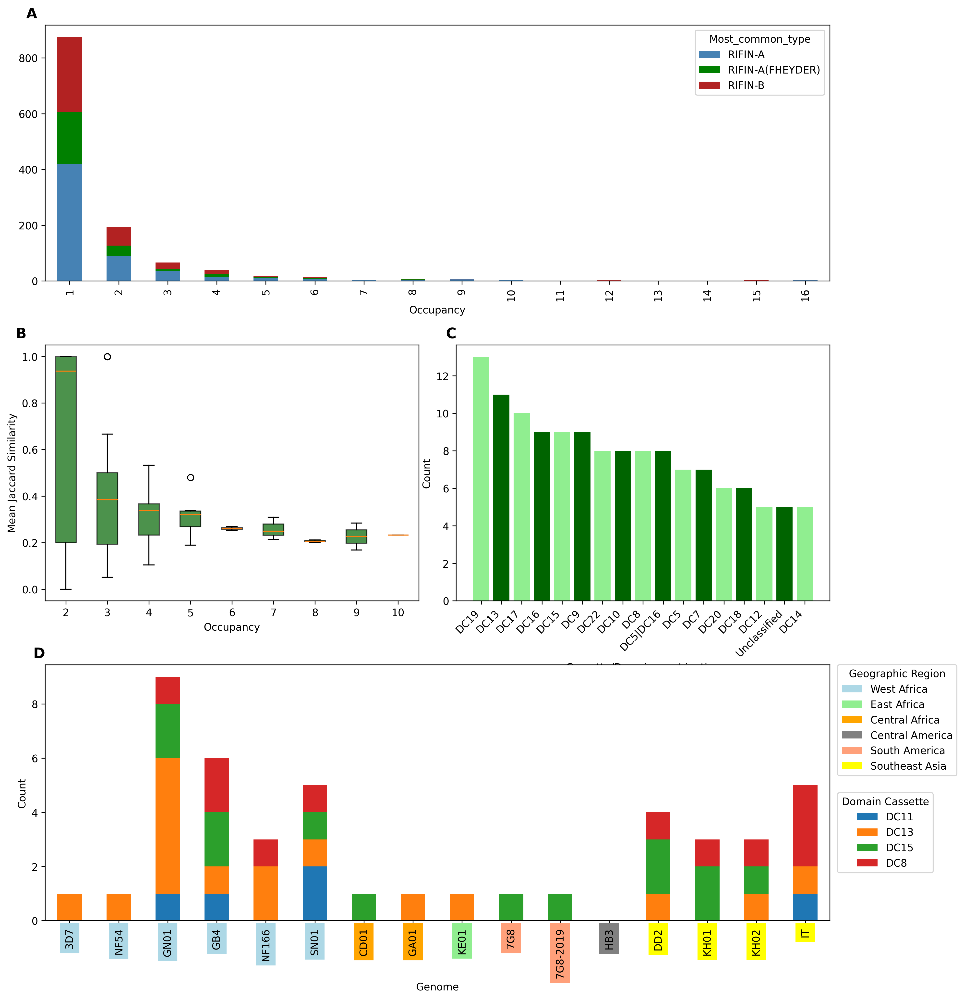

# Construction of the Plasmodium falciparum Pangenome and AI-Based Functional Annotation
The scripts used to construct and analysis the pangenome of *Plasmodium falciparum*, as well
as the AI-based functional prediction of unknown *P. falciparum* genes.

# *P. falciparum* pangenome
----------------------------
## LiftOff Analysis
Prior to pangenome construction, LiftOff version 1.6.3 was used to transfer the curated 
gene annotations of the 3D7 reference genome to the 19 non-reference *P. falciparum* 
assemblies. This was performed as a quality check to assess whether the existing genome 
annotations required updating before inclusion in the pangenome. GffCompare version 0.12.10 
was used to compare the lifted over annotations to the original genome annotations, and 
pairwise protein alignment was carried out to characterise any non-exact matches. Only 
limited differences were identified and the original annotations were retained for 
pangenome construction.

Full details of the LiftOff analysis, including scripts and results, can be found in the
[LiftOff README](LiftOff/README.md).

----------------------------
## Running GET_PANGENES to Produce the *P. falciparum* Pangenome

To construct the *P. falciparum* pangenome, the GET_PANGENES pipeline was run on 20 
whole-genome *P. falciparum* assemblies.
Full details of the pipeline, scripts and 
outputs can be found in the [GET_PANGENES README](GET_PANGENES/README.md).

----------------------------
## Rerunning GET_PANGENES
The analysis was re run on 16 genomes excluding ML01, TG01, SD01 and NF135.C10 were not found to be of high enough quality (mixed infections, assembly errors).These genomes were inflating the cloud, shell and soft-core count. Pseudogenes were also included to
promote pangenome completeness.
The below panel highlights the issues with the 20 genome pangenome
.

The results and scripts of the higher quality 16 genome pangenome are also found in [GET_PANGENES README](GET_PANGENES/README.md).

----------------------------
## Analysing the pangenome

The mean percentage of pangenes with InterPro IDs, protein length, paralog count and ortholog count were mapped to the pangenome.
All of the scripts and analyses are found here [Exploring the pangenome README](Exploring_the_pangenome/README.md)

----------------------------
## Evidence for pangenes
Mean pLDDT scores, RNA-seq data and peptide counts were mapped to the pangenome.
All of the scripts and analyses are found here [Exploring the pangenome README](Exploring_the_pangenome/README.md)

----------------------------
## Characterising the functions of pangenes
GO enrichment analysis was performed on the cloud and core genes. The scripts and outputs are found here: [README.md](Function_of_pangenes/README.md)

The representative InterPro domain was also assigned to each cluster and the percentage occupancy of that domain across the cluster was calculated. Selected families were explored as a case study to compare core vs host interaction associated domains

----------------------------
# Duplications and reference absent genes
Duplicated genes within a pangene cluster were identified. Reference absent genes were lifted over to 3D7 to find genes that 
don't map to the reference genome. All of the scripts and outputs are found here [Duplications and Reference Absent Genes README](Duplications%20and%20Reference%20Absent%20Genes/README.md)

----------------------------
## *rif* and *var* analysis
*rif* subtypes were assigned using STRIDE and FHEYDER motifs were identified using exact string matching.

*var* domain types were assigned using VarDom and subtypes were identified using BLAST searching, allowing domain cassettes to be identified. 

More detail can be found here
[rif_var_analysis/README.md](rif_var_analysis/README.md)

This allowed *rif* subtypes to be explored across the different pangenome occupancies, as well as exploration of *var* domain cassette consistency across pangenes and across geographical locations.

----------------------------
# ProtNLM analysis
The performance of ProtNLM was evaluated on *P. falciparum* curated genes, as well as *Babesia ovis* an apicomplexan species that was 
absent from ProtNLM's training data. The performance of ProtNLM was compated to BLAST. 
The scripts and outputs of this analysis can be found here [ProtNLM/README.md](ProtNLM/README.md)

----------------------------
# AI Transcriptional Expression Summary
The beta PlasmoDB summary was evaluated to assess how well the language used matches the magnitude of change. Differential expression
statistics, directional fold change percentiles and explicit confidence and biological importance scoring was calculated and the
PlasmoDB AI expression summary pipeline was modified to include this new data. The LLM was also asked to compare both the original
summary and the new statistical one. The prompts are scripts are found here [AI Expression Summary/README.md](AI%20Expression%20Summary/README.md)

----------------------------
# AI function prediction pipeline
Alongside the transcriptomics data, additional data types such as WGCNA coexpression, hyperLOPIT subcellular localisation data and MAP-X predicted interactions were provided to the Claude Opus 4.6. It was asked to give functional predictions and justifications for its findings. The outputs, prompts and scripts can be found here [AI Function Prediction Pipeline/README.md](AI%20Function%20Prediction%20Pipeline/README.md). This pipeline was run on genes with literature supported annotations and unknown genes.

To evaluate the use of AlphaFold3 in this pipeline, AF3 was first run on curated interactions. Its performance was also assessed on WGCNA coexpressed genes and predicted MAP-X interactors. Further information can be found here [AI Function Prediction Pipeline/README.md](AI%20Function%20Prediction%20Pipeline/README.md).

